# 🏆 FootyCup – Football Tournament Management System

FootyCup is a web application for managing **amateur football tournaments**. It supports user registration, tournament creation and management, automatic competition format generation (group, knockout, or mixed), team assignment to slots, and live score tracking. An admin panel is included for user management.

---

## ✨ Main Features

### 👥 Authentication & Authorisation
- **Registration & Login** using JWT stored in **HttpOnly cookies**
- **Session handling** with refresh tokens
- Automatic session renewal with user confirmation
- **User roles:** `USER`, `ADMIN`

### ⚽ Tournaments
- Create your own tournaments
- Browse, edit, and delete tournaments
- Assign teams
- Manage competition format, schedule, and progression

### 🧠 Competition Formatting
- Automatic generation of **group**, **knockout**, or **mixed** formats
- Random team assignment to groups
- Manual team assignment to specific slots or nodes

### 🛡️ Admin Panel
- User table with search & filter
- Ability to delete users
- Access restricted to authenticated admins

---

## 🧰 Tech Stack

### Backend
- **Java 17** & **Spring Boot**
- **Spring Security + JWT** (authorisation & roles)
- **Hibernate (JPA)** – ORM with automatic schema generation
- **PostgreSQL**
- **Swagger** – REST API documentation
- **RabbitMQ** – asynchronous e-mail handling

### Frontend
- **Angular 17+**
- **RxJS** – reactive state & async flows
- **Angular Material** – UI components
- **HttpClient** for API calls
- Comprehensive error, loading, and empty-state handling

> A popular, stable, and widely supported stack ensures a **scalable & secure backend** (Java 17 + Spring Boot/JPA/PostgreSQL + JWT + RabbitMQ) and **fast development of a reactive, consistent frontend** (Angular 17 + RxJS + Material) with automatic API documentation (Swagger).

---

## ⚙️ Architecture & Technology

### 🔙 Backend – Spring Boot & Hibernate (JPA)

#### Controller Layer
REST controllers that handle HTTP requests:
- `AuthController` – registration, login, token refresh
- `UserController` – user data, account deletion (admin)
- `TournamentController` – tournament CRUD
- `FormatController`, `ScheduleController`, `MatchController`, `ResultController` – logic for formats, schedules, matches, and results

#### Service Layer
Contains business logic such as format generation, team assignment, and validations.

#### Data Layer (`model`, `repository`)
- Entity models + `JpaRepository` for DB operations
- Indexes added via `@Index` (e.g., `User.email`, `User.lastname`) for efficient queries

#### Security
- JWT tokens stored in **HttpOnly cookies**
- `TokenAuthenticationFilter` for authentication
- `WebSecurityConfig` for security & CORS configuration

#### Miscellaneous
- **GlobalExceptionHandler** for unified error handling
- **RabbitMQ**: `EmailProducer`, `EmailConsumer` for welcome emails

---

### 🔛 Frontend – Angular, RxJS & Material

#### Routing & Guards
- `AuthGuard` – routes accessible only to authenticated users
- `AdminGuard` – routes accessible only to `ADMIN` role (read from JWT)

#### View Components (`pages`)
- `login`, `register` – authentication
- `tournament`, `schedule`, `match`, `result` – core tournament logic
- `team`, `player` – team & player management
- `admin-users` – admin panel for user management

#### Services
- HTTP handling: `auth.service.ts`, `user.service.ts`, `tournament.service.ts`, etc.
- `notification.service.ts` – SnackBar notifications
- **Token watcher** – automatic token refresh + 30-second expiry warning

#### Interceptors
- `token.interceptor.ts` – sets `withCredentials` & parses token from cookies

#### Models
Define data structures exchanged between frontend & backend.

---

## 🗂️ Data Initialisation
Sample users, tournaments, and other records are provided in **`data.sql`**.  
Hibernate generates the database schema automatically (`spring.jpa.hibernate.ddl-auto=update|create`).

- **13 user accounts** (1 **admin**, 12 **users** who can act as coaches)  
- **1 tournament**  
- **12 teams** with assigned coaches and several players  

These records let you test the full flow: pick a tournament format, generate matches, and manage schedule & results.

### 🔐 Test Credentials

| Email | Role |
|-------|------|
| **ewalker@example.com** | ADMIN |
| lhall@example.com | USER |
| jsmith@example.com | USER |
| ejohnson@example.com | USER |
| mwilliams@example.com | USER |
| ebrown@example.com | USER |
| djones@example.com | USER |
| ogarcia@example.com | USER |
| mmiller@example.com | USER |
| sdavis@example.com | USER |
| jmartinez@example.com | USER |
| ahernandez@example.com | USER |
| wlopez@example.com | USER |
| igonzalez@example.com | USER |

**Password for all accounts:** `test123`

---

## ER Diagram
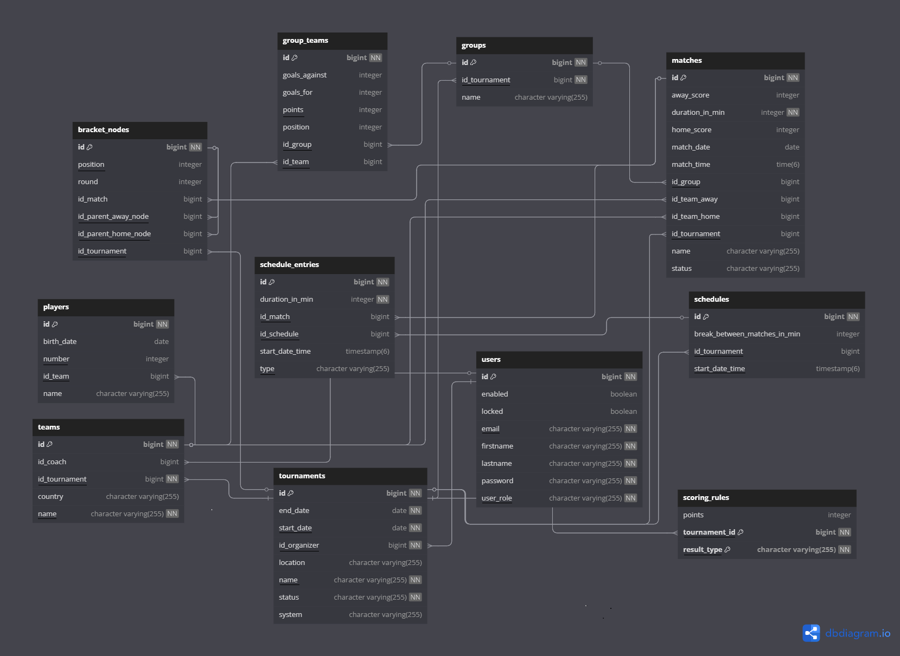

*Notation: **bold** = primary key, <u>underlined</u> = indexed column.*

### Core Tables & Relationships
| Table | Purpose | Key Relations & Indexed Columns |
|-------|---------|---------------------------------|
| **users** | Accounts and roles. | **id**, <u>email</u>, <u>lastname</u>.<br>Linked to `tournaments.id_organizer` and `teams.id_coach`. |
| **tournaments** | High-level entity for each competition. | **id**, <u>name</u>.<br>`id_organizer → users.id`. |
| **teams** | Clubs/squads taking part in a tournament. | **id**, <u>name</u>.<br>`id_tournament → tournaments.id`; `id_coach → users.id`. |
| **players** | Individual athletes on a team. | **id**.<br>`id_team → teams.id`. |
| **groups** | Round-robin pools within a tournament. | **id**, <u>name</u>.<br>`id_tournament → tournaments.id`. |
| **group_teams** | Join table: which team is in which group, incl. standings. | **id**.<br>`id_group → groups.id`; `id_team → teams.id`. |
| **matches** | Single fixtures with score & status. | **id**.<br>`id_tournament`, `id_group` (nullable), `id_team_home`, `id_team_away`. |
| **schedule_entries** / **schedules** | Calendar of matches with drag-&-drop editing. | **id** (*both tables*).<br>`id_schedule → schedules.id`; `id_match → matches.id`. |
| **bracket_nodes** | Knock-out bracket tree nodes. | **id**.<br>`id_parent_home_node`, `id_parent_away_node`, `id_match` (all nullable). |
| **scoring_rules** | Custom points for win/draw/loss. | **id**, `result_type`, `points`.<br>`tournament_id → tournaments.id`. |

Indexes (underlined fields) accelerate frequent look-ups for e-mail, last-name, tournament names, and foreign-key joins (e.g., `id_tournament`, `id_group`, `id_team`). Together they ensure fast schedule generation and live-update queries during play.


---

## ✅ Error & State Handling
- Error & success messages displayed via `NotificationService` (SnackBar)
- Automatic logout on token expiry
- Loading & empty states handled with `*ngIf`, `async`, and loading/error flags in components

---

## 🎯 Technical Highlights
- JWT + Refresh tokens (HttpOnly cookies)
- User data prefetch on page refresh
- Role-based access (**admin panel**)
- Modular architecture with clear separation into components / services / guards

---

## 🚀 Getting Started

### Prerequisites
- **Java 17**
- **Node.js 18+** & **Angular CLI**
- **RabbitMQ** service (local or Docker)
- **PostgreSQL** database

### Running the Project

#### Backend (IntelliJ IDEA / Terminal)
```bash
# Start RabbitMQ (Windows example)
rabbitmq-service.bat start

# Run Spring Boot application
./mvnw spring-boot:run
```
The application starts on http://localhost:8080/. Swagger documentation is available at http://localhost:8080/api/docs.
#### Frontend (VS Code / Terminal)
```bash
cd frontend
ng serve
```
The Angular dev server runs at http://localhost:4200/.

## Quick guide
1. **User registration**

 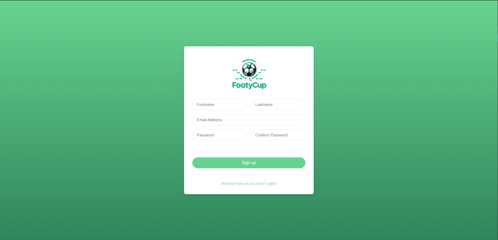
 
2. **User login**

 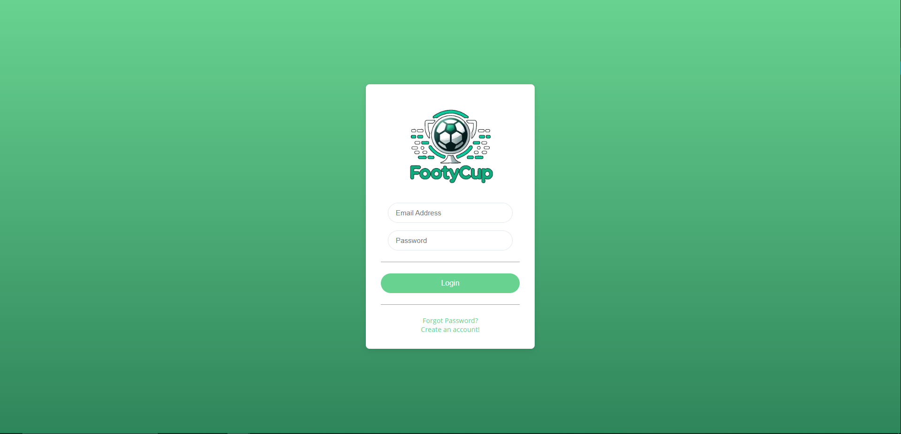

3. **Tournament panel**

 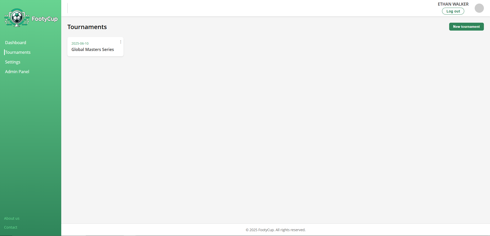

4. **Adding tournament**

 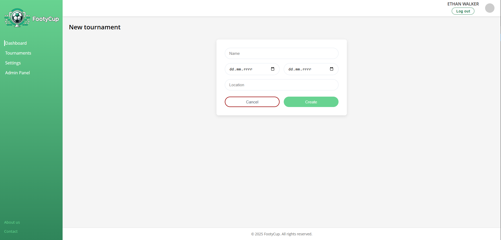

5. **Tournament details**

 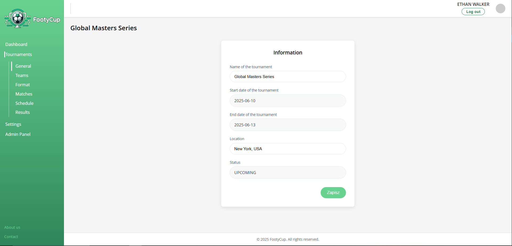

6. **Teams**

 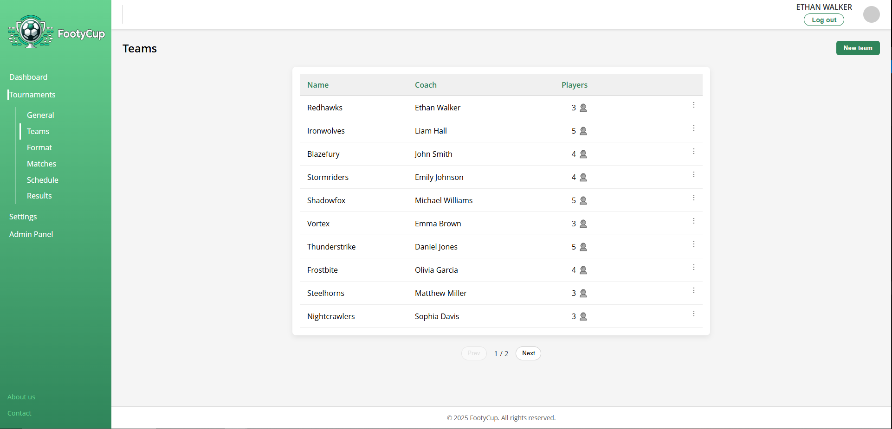

7. **Edit team, list of players**

 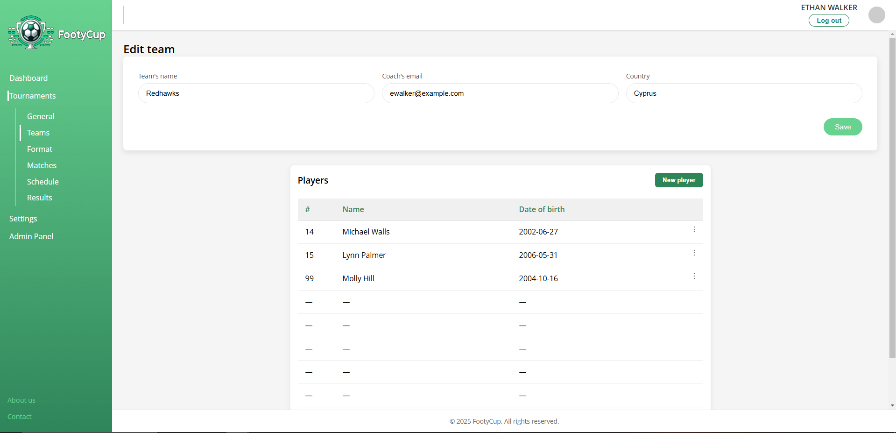

8. **Selection of tournament format**

 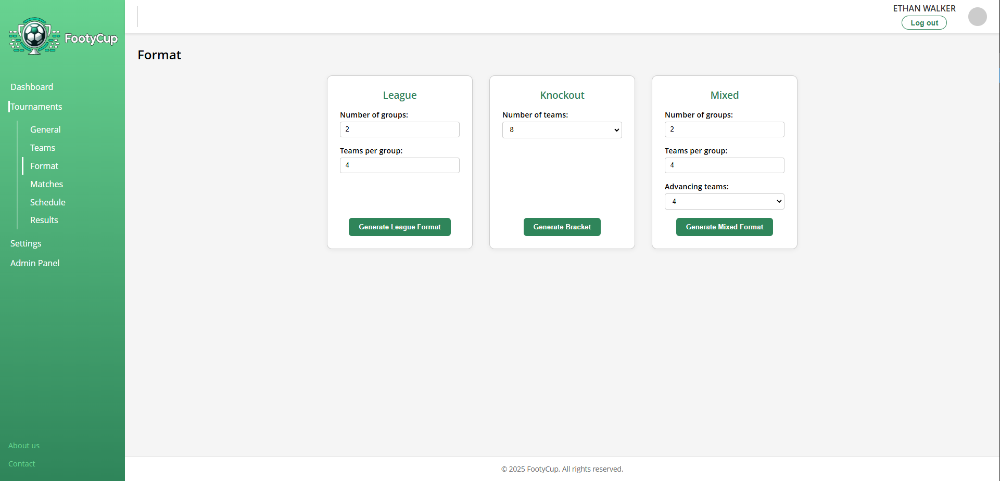

9. **Selected format with assigned teams**

 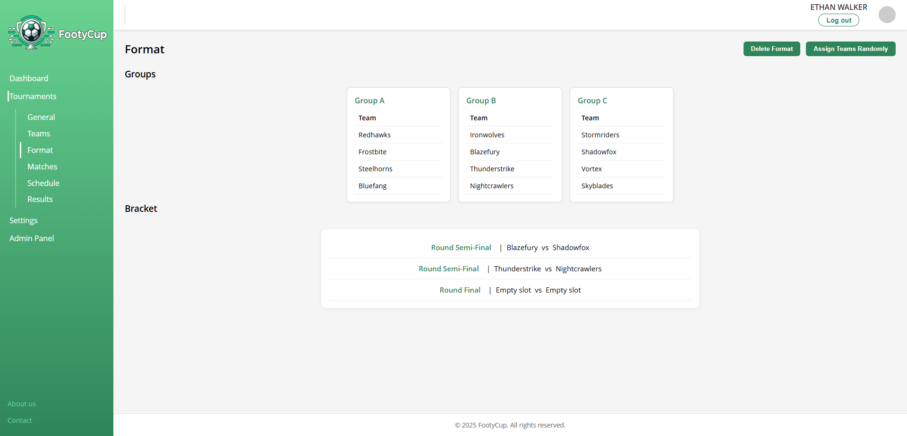

10. **List of matches**

 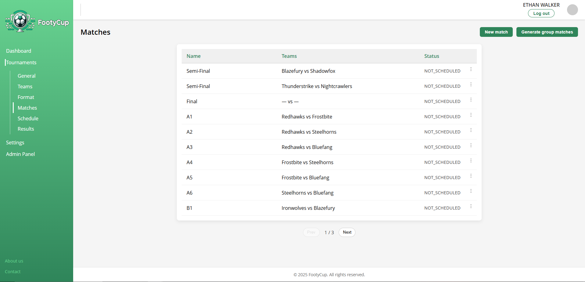

11. **Schedule (Drag & Drop)**

 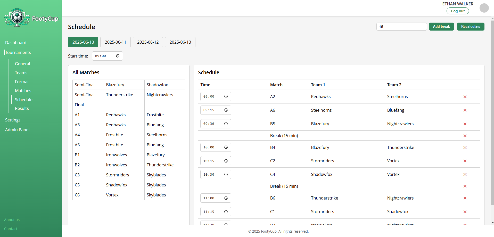

12. **Results, groups and ladders**

 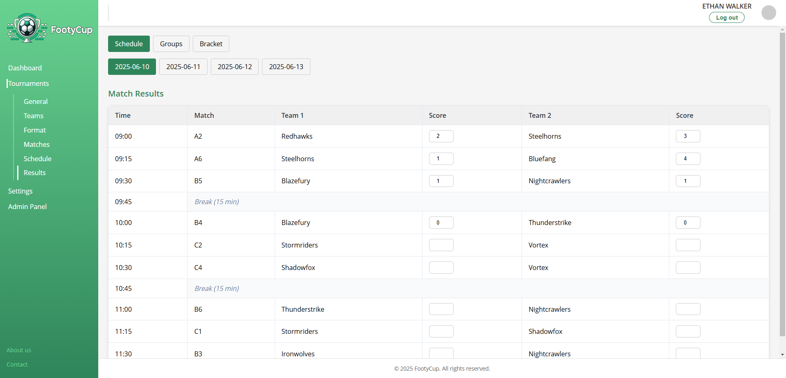
 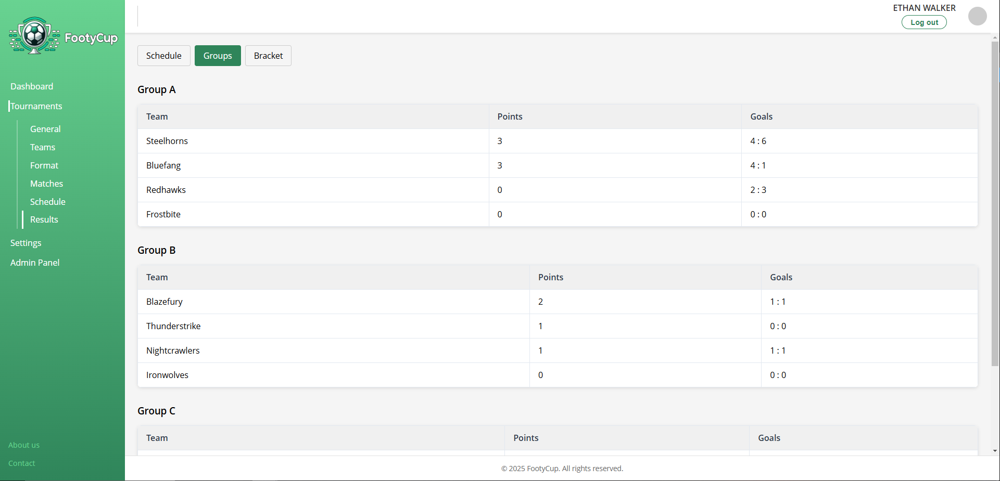
 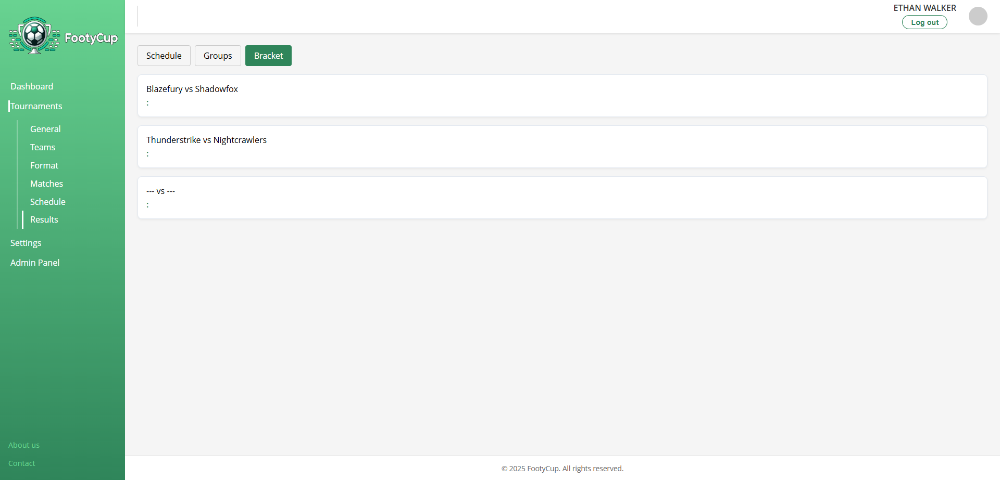

13. **Admin panel**
    
 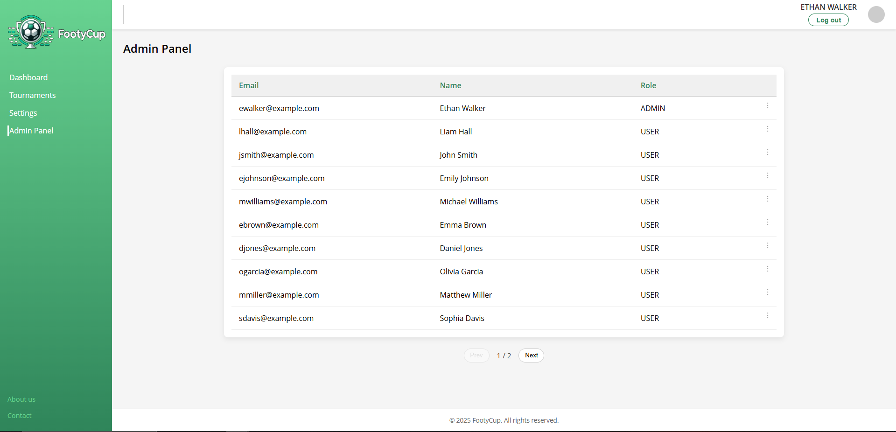

